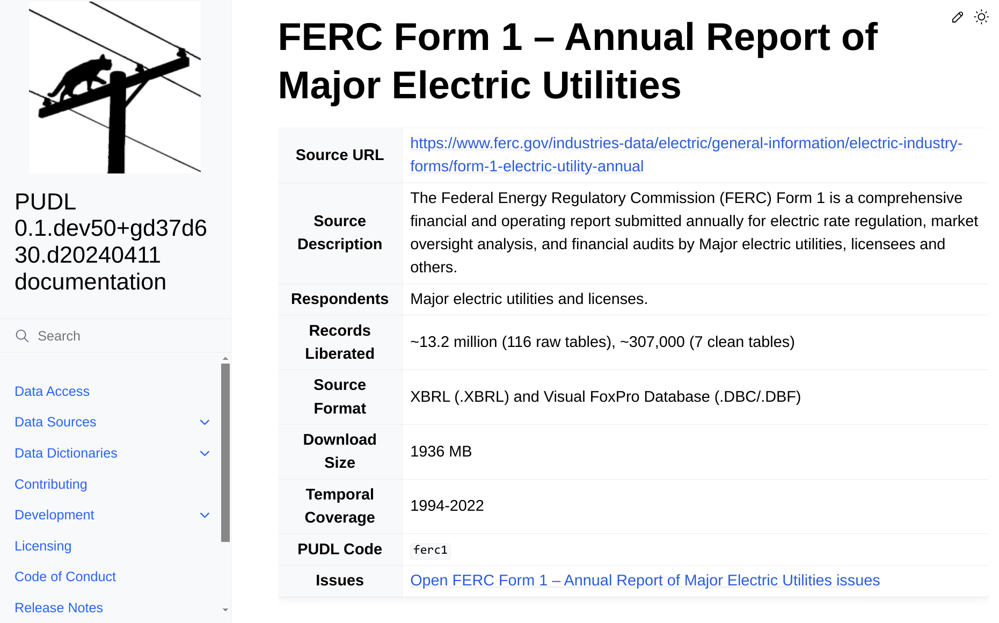

# Enhancing Access to FERC Data 📊

> *The Federal Energy Regulatory Commission, or FERC, is an independent agency that regulates the interstate transmission of electricity, natural gas, and oil*.

FERC publishes its data for everyone to use, such as the [**FERC Form 1**](https://catalystcoop-pudl.readthedocs.io/en/nightly/data_sources/ferc1.html) : **Annual Report of Major Electric Utilities.**

This report serves as a crucial tool in understanding the operations and financial health of major electric utilities, providing valuable insights into the energy sector's dynamics and trends.

## The Problem ⚠️🔍

The problem revolves around the difficulty in **accessing & utilising** FERC's data, which is compounded by several key factors:

-   **Legacy Format Challenges**: FERC's data, spanning from 1994 to 2020, was stored in the proprietary [FoxPro database](https://en.wikipedia.org/wiki/FoxPro) binary format. This format presents significant hurdles for parsing and analysis due to its complexity.
-   **Transition to XBRL**: In 2021, FERC transitioned to [XBRL](https://en.wikipedia.org/wiki/XBRL), introducing another layer of complexity to the data handling process.
-   **Data Quality Issues**: Additionally, the data itself suffers from being unclean and poorly organized, rendering it inaccessible to many potential users.
-   **Limited Integration**: Currently, only a small fraction of FERC's available data has been integrated into Partially-Ordered Data eXtraction Library (PUDL).

## The Solution ✅💡

To address the above mentioned problems, we aim to provide programmatic access to the bulk raw data, independent of the cleaner subset included within PUDL.

To achieve this goal, we've broken down the [pudl.extract.ferc1](https://catalystcoop-pudl.readthedocs.io/en/nightly/autoapi/pudl/extract/ferc1/index.html#module-pudl.extract.ferc1) process into several distinct steps:

1. Firstly, **clone** the annual database from FoxPro (DBF) format spanning from 1994 to 2020 into a local file-based [sqlite3](https://docs.python.org/3/library/sqlite3.html#module-sqlite3) database.

2. **Create** another [sqlite3](https://docs.python.org/3/library/sqlite3.html#module-sqlite3) database, with a different structure, by cloning the 2021 and later data from XBRL. This database will be derived from the [FERC Form 1](https://xbrlview.ferc.gov/yeti/resources/yeti-gwt/Yeti.jsp#tax~%28id~8*v~72%29!net~%28a~143*l~35%29!lang~%28code~en%29!rg~%28rg~4*p~1%29) XBRL taxonomy.

3.  After creating the databases, **select** a limited subset of the tables in these databases for further processing. This subset will be integrated into the PUDL [sqlite3](https://docs.python.org/3/library/sqlite3.html#module-sqlite3) database.

> *Fun Fact: The FoxPro and XBRL derived FERC Form 1 databases boast an impressive array of over 100 tables, collectively housing more than 3000 columns of data. That's a treasure trove of information waiting to be explored and analyzed! ✨*
